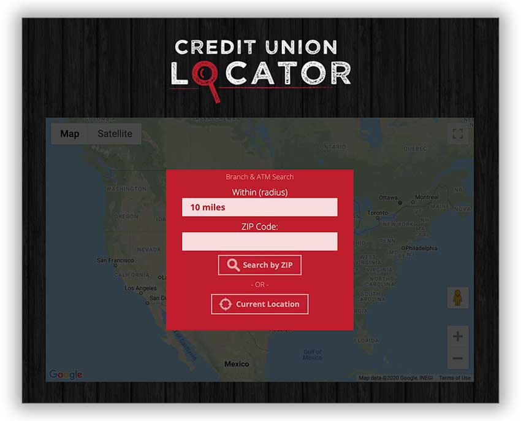

## Credit Union Locator

This repository contains a website for a credit union locator, and an API with multiple endpoints to search a MySQL database filled with Credit Union ATM and Branch locations.



*****

### Installation

To install this, clone the repository to a folder on your server, like so:

```shell
git clone https://github.com/jpederson/cu-locator.git && cd cu-locator
```

Next, make a mysql database, and a user, and import the `db.sql` into the new database. 

```shell
cp config-sample.php config.php
```

Enter your database credentials and db name into the config.php file.

*****

Developed with love by [James Pederson](https://jpederson.com).